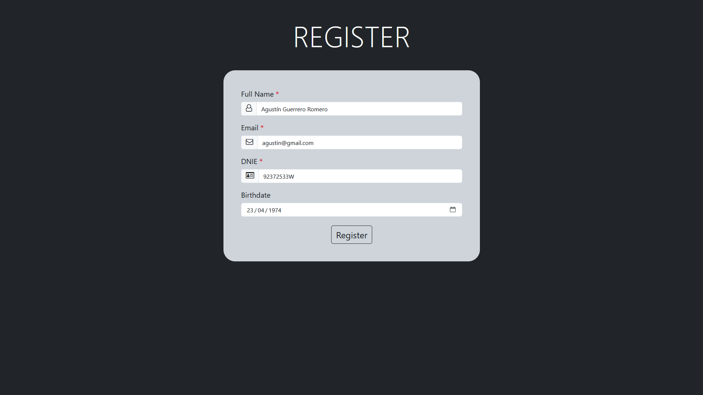
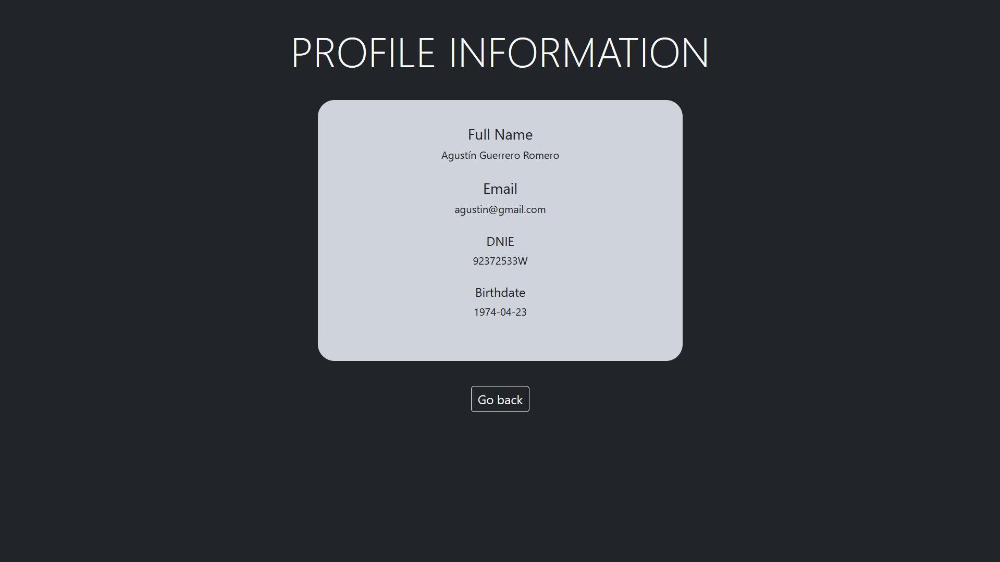
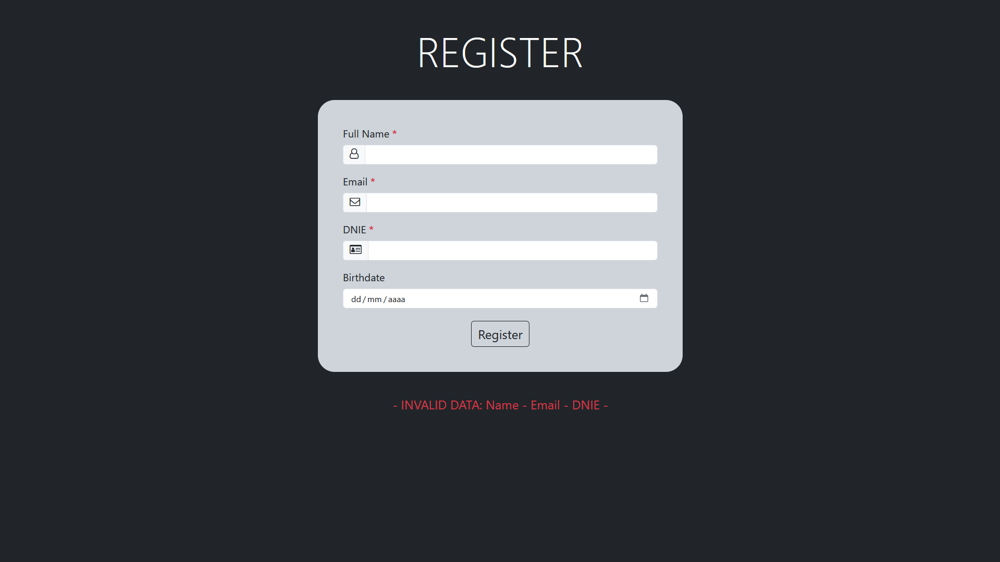
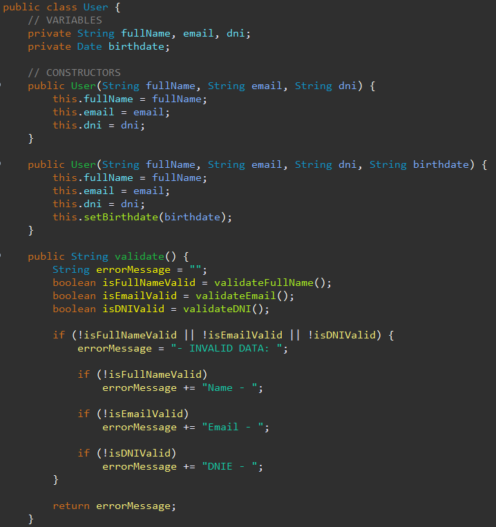
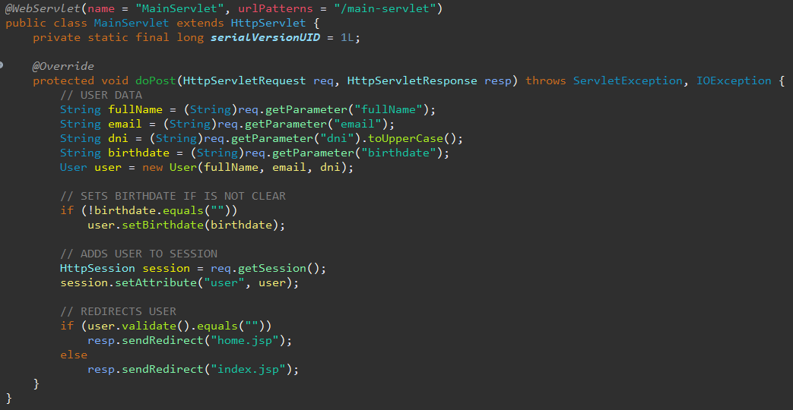
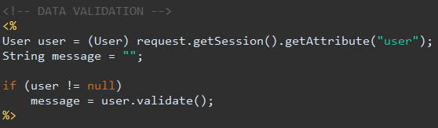
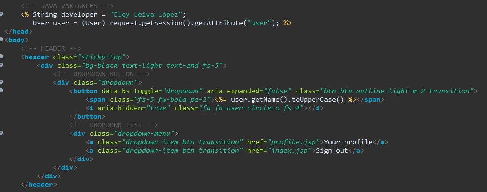
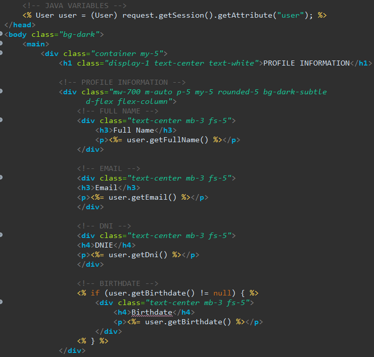

# Presentación DUAL 1º DAM - Eloy Leiva López

## Presentación en grupo
Link a la [presentación en grupo](https://www.canva.com/design/DAGGN6EK2kc/HYAimlMYs5RSJxU7h1lwqw/view?utm_content=DAGGN6EK2kc&utm_campaign=designshare&utm_medium=link&utm_source=editor).

## Presentación individual
Vídeo del [proyecto intermedio de JSP](https://youtu.be/Ixd1xm60gYE).  
Después de hacer los ejerciciso de repaso de Java, nos mandaron hacer un proyecto individual de JSP.  
El cuál nos ayudaría a entender tanto el funcionamiento de los servlets como el del manejo de sesiones en páginas web dinámicas.  
  
Este proyecto consistiría en un registro, al registrarte podrías entrar a una página principal y acceder a la información del usuario que se acaba de registrar.  
  

Entonces poniendo un nombre completo, un email y un dni y pulsando en el botón de registrar estaríamos en la página principal, que contiene un botón dinámico con el nombre del usuario para acceder a su perfil.  
  

Al pulsar el botón accedemos a su información y podríamos ver los datos introducidos en el registro.  
  

Este registro también tiene validaciones por lo que al intentar acceder sin datos o con datos no válidos nos aperecerá un mensaje de error indicando los datos no válidos.  
  

Aquí podemos ver el funcionamiento de la clase usuario, el cuál recoge nombre completo, email, dni y fecha de nacimiento, crea el usuario dependiendo la información introducida y la valida.  
  

Algunas de las cosas que he aprendido es el funcionamiento de los servlets, se activan al pulsar el submit del formulario realizando una acción u otra dependiendo del tipo de formulario, pudiendo ser GET o POST. Al ser un registro es un POST y le he indicado que cree un usuario con la información introducida y la guarde en la sesión.  
  
La sesión nos permite que la información que he guardado se quede en el navegador hasta que este se cierre.  
  
Al comprobar la información del usuario, si es válida accederá a la página principal y en caso contrario volverá al registro.  
  

Al haber pasado el servlet y ser la información inválida volviendo al registro, obtendremos el usuario creado y el mensaje de error que mostrará. 
  

Al haber pasado el servlet y ser la información válida pasando a la página principal, obtendremos el usuario creado y lo usaremos para poner su nombre en el botón para acceder al perfil.  
  

En la página el perfil del usuario obtendremos la información del usuario para poder mostrarla.  
  

