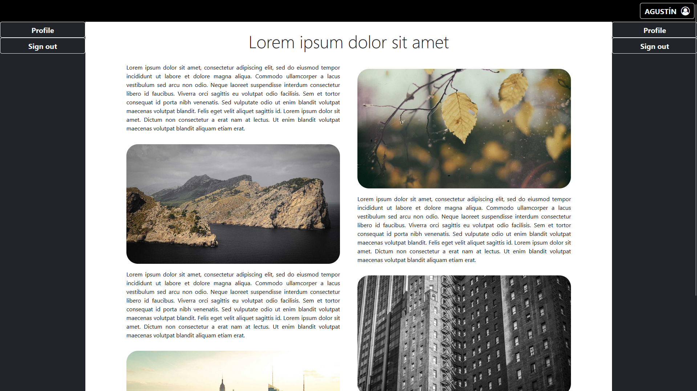

# Presentación DUAL 1º DAM - Eloy Leiva López

## Presentación en grupo
Link a la [presentación en grupo](https://www.canva.com/design/DAGGN6EK2kc/HYAimlMYs5RSJxU7h1lwqw/view?utm_content=DAGGN6EK2kc&utm_campaign=designshare&utm_medium=link&utm_source=editor).

## Presentación individual
Vídeo del [proyecto intermedio de JSP](https://youtu.be/Ixd1xm60gYE).  
Después de hacer los ejerciciso de repaso de Java, nos manadaron hacer un proyecto individual de JSP.  
El cuál nos ayudaría a entender tanto el funcionamiento de los servlets como el del manejo de sesiones en páginas web dinámicas.  

Este proyecto consistiría en un registro, al registrarte podrías entrar a  
landing page y acceder a la información del usuario que se acaba de  
registrar.  
</img>

Entonces poniendo un nombre completo, un email y un dni y pulsando  
en el botón de registrar estaríamos en la página principal, que contiene  
un botón dinámico con el nombre del usuario para acceder a su perfil.  
</img>

Al pulsar el botón accedemos a su información y podríamos ver los  
datos introducidos en el registro.  
</img>

Este registro también tiene validaciones por lo que al intentar acceder  
sin datos o con datos no válidos nos aperecerá un mensaje de error  
indicando los datos no válidos.  
</img>
